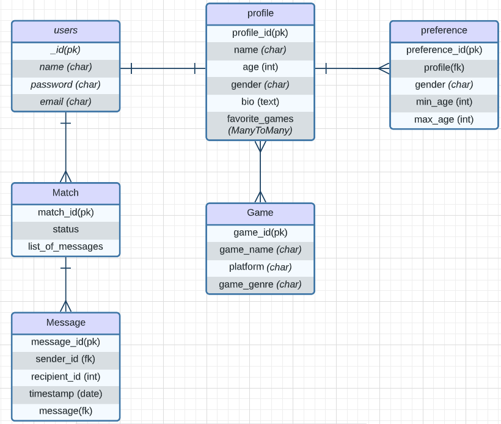

# Gamer Dating Full-Stack Application


## OVERVIEW

Gaming is more than just a hobby, it's a passion and a community.  Our dating app is designed specifically for gamers, whether you're into console gaming, PC gaming, or both. Our goal is to help you connect with the perfect match on our platform.

Users can update their profiles with information about themselves, including their display name, profile picture, description, list of interests and games played. This information is used to match users with other users who have similar interests, games played, and send messages to each other.

Whether you're looking for a casual gaming buddy or a long-term relationship, our app will help gamers build lasting connections within the gaming community.


### Technology

- Python
- Django
- PostgreSQL database
- Django's ORM (Object-Relational Mapping)
- HTML
- CSS
- JavaScript


## Entity Relationship Diagram




## USER STORIES

```
As a user, AAU, I want the ability to...
- access more features by signing up.
- connect with others who play similar games as I do.
- send messages to people that I connect with that have similar interests.
- create and customize my profile with pictures I upload, and an about me section.
- search up game titles to add tags to my profile.
- see a list of games with their general information.
```


## Wireframes


## Screenshots


## INSTRUCTIONS

- 


## Trello Board

[Trello](https://trello.com/b/b7HdhKMr/datinggamers)


## Planned future enhancements

- 


## Credits

Wireframes and ERD was created using [Lucidchart](https://www.lucidchart.com/).